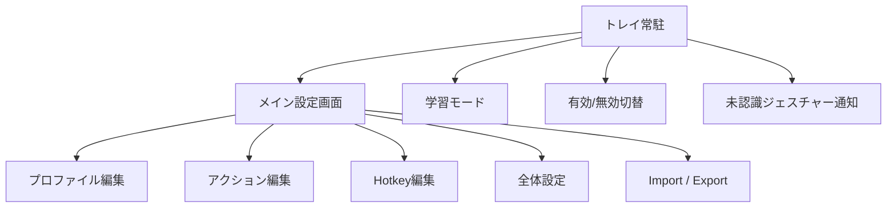

# ジェスチャーHotkeyアプリ 要件ドラフト v2

作成日: 2026-06-23  
更新日: 2026-06-23  
ベース調査対象: `StrokeIt Home .9.7`

## 1. 目的

Windows 11 専用の常駐型マウスジェスチャーアプリを新規実装する。  
本アプリは、マウスジェスチャーを入力すると、設定済みの Hotkey を送信することに特化したツールとする。  
StrokeIt の中核体験である「常駐」「ジェスチャー認識」「アプリ別割り当て」を継承しつつ、用途を Hotkey 入力に限定して、UI と保存方式を現代化する。

## 2. プロダクトゴール

- ユーザーが Windows 11 上でマウスジェスチャーから Hotkey を高速入力できる
- アプリごとに異なるジェスチャー設定を持てる
- 2系統のジェスチャー開始ボタンを使い分けられる
- UI を日本語で提供し、学習コストを下げる
- 機能を絞ることで軽量・安定・高速な常駐動作を実現する

## 3. 非ゴール

- StrokeIt の完全互換バイナリ
- StrokeIt の設定ファイル完全互換
- Program 実行、URL 起動、メール起動、Window 操作などの汎用コマンド実行
- 初版からの外部 DLL プラグイン対応
- 初版からの Lua スクリプト互換
- 左ボタンによるジェスチャー開始

## 4. 想定ユーザー

- キーボードショートカットをジェスチャーで呼び出したい Windows 11 ユーザー
- ブラウザ、エディタ、ファイラーなどで操作を高速化したいユーザー
- 複雑な自動化より、安定した Hotkey 入力を優先するユーザー

## 5. 対応環境

- 対応 OS: Windows 11
- 対応言語: 日本語 UI
- 初版想定入力デバイス:
  - 3ボタン以上のマウス
  - 中ボタン、右ボタン、XButton1、XButton2 のいずれかを開始ボタンとして利用可能
- 左ボタンは開始ボタンとして使用不可

## 6. MVP スコープ

### 必須機能

- Windows 11 常駐
- マウスジェスチャー認識
- グローバルプロファイル
- アプリ別プロファイル
- アプリ識別
  - `process name`
  - `window class`
  - 必要に応じて `window title`
- Action 管理
  - 1 Action に複数 gesture を登録可能
  - 1 Action に実行コマンドを 1 つ登録
- コマンド種別
  - SendHotkey のみ
- 学習モード
- 未認識ジェスチャーの学習導線
- トレイアイコン
- 一時無効化 / 有効無効切替
- Windows 起動時自動起動
- 設定のエクスポート / インポート
- 日本語 UI
- ジェスチャー開始ボタン 2系統設定
  - Trigger A
  - Trigger B
- 各系統で開始ボタンを個別設定可能
- 同一ジェスチャー形状でも系統ごとに別 Hotkey を割り当て可能

### あれば良い

- ジェスチャー描画色
- ジェスチャータイムアウト
- アプリ識別のワイルドカード
- 無効化専用プロファイル
- Trigger A / Trigger B ごとの描画色分離

## 7. 初版で外す機能

- RunProgram
- OpenUrl
- OpenMail
- Window maximize/minimize/next/prev
- Delay など Hotkey 以外の汎用コマンド
- 外部 DLL プラグイン
- Lua scripting
- Business Trial / License 管理
- OSD の高度な装飾
- Win32 message send/post
- マルチモニタ専用操作
- Password 専用コマンド
- 古いアプリ向け大量プリセット同梱
- 左ボタン開始対応

## 8. 画面要件



### 画面一覧

- トレイ常駐状態
- メイン設定画面
- プロファイル編集
- アクション編集
- Hotkey 編集
- 学習モード
- 未認識ジェスチャー通知
- 全体設定
  - 一般
  - トリガー設定
  - 保存 / バックアップ
  - 言語
- Import / Export

## 9. 機能要件

### FR-01 ジェスチャー認識

- ユーザーは設定済み開始ボタン押下中の軌跡で gesture を入力できる
- システムは gesture を正規化して既存テンプレートと照合する
- システムは認識結果を最も適切な action に解決する
- 左ボタン押下は gesture 開始入力として扱わない

### FR-02 2系統トリガー

- システムは Trigger A と Trigger B の 2 系統を持つ
- 各 Trigger は個別に開始ボタンを持てる
- 各 Trigger の開始ボタンは設定で変更できる
- 同一の開始ボタンを両 Trigger に設定することは不可とする
- 各 Trigger は独立した gesture-to-hotkey マッピングを持てる
- 同一ジェスチャー形状でも、Trigger A と Trigger B で別の Hotkey を設定できる

### FR-03 プロファイルマッチング

- プロファイルは以下の識別子を持てる
  - process name
  - window class
  - window title
- 1 プロファイルに複数識別子を登録できる
- `exclude` 相当の無効化モードを持てる

### FR-04 アクション定義

- Action は名前を持つ
- Action は複数 gesture を持てる
- Action は Trigger A または Trigger B のどちらに属するかを持つ
- Action は 1 つの SendHotkey 設定を持つ

### FR-05 Hotkey 実行

- 初版の実行コマンドは SendHotkey のみとする
- Hotkey は修飾キーと通常キーの組み合わせを設定できる
- Hotkey はキー押下順序を OS 入力として送信する
- 対象アプリが前景の間に Hotkey を送信する

### FR-06 学習モード

- ユーザーは gesture サンプルを追加学習できる
- 既存 gesture へのサンプル追加と新規 gesture 作成を選択できる
- 認識結果レビューを表示する

### FR-07 未認識ジェスチャー導線

- 未認識時に通知できる
- そこから学習モードへ遷移できる
- 今後プロンプトを常に出す設定を持つ

### FR-08 設定

一般:

- Windows 起動時に開始
- トレイアイコン表示
- 一時無効化
- ジェスチャータイムアウト
- 描画線の表示 / 非表示
- 描画色と線幅
- 日本語 UI

トリガー設定:

- Trigger A の開始ボタン
- Trigger B の開始ボタン
- 左ボタンは選択肢に表示しない
- 開始ボタンの重複禁止

保存:

- 設定の保存先
- バックアップ / 復元
- Export / Import

### FR-09 Import / Export

- プロファイル、gesture definitions、settings を 1 つのパッケージとして export できる
- 同パッケージを import できる
- Trigger A / Trigger B の割り当ても含めて保存できる

## 10. データモデル案

```ts
type TriggerSlot = "A" | "B"

type TriggerButton =
  | "middle"
  | "right"
  | "xbutton1"
  | "xbutton2"

type AppProfile = {
  id: string
  name: string
  enabled: boolean
  mode: "include" | "exclude"
  matchers: Matcher[]
  actions: GestureAction[]
}

type Matcher = {
  type: "process" | "class" | "title"
  value: string
  pattern: boolean
}

type GestureAction = {
  id: string
  name: string
  triggerSlot: TriggerSlot
  gestureIds: string[]
  command: HotkeyCommand
}

type HotkeyCommand = {
  type: "sendHotkey"
  hotkey: string
}

type TriggerSettings = {
  triggerAButton: TriggerButton
  triggerBButton: TriggerButton
}
```

## 11. 保存方式の提案

StrokeIt は `cfg + bin + registry` に分散しているが、独自アプリでは以下を推奨。

### 推奨

- `config.json` または `config.sqlite`
- `gesture_templates.json`
- `profiles.json`
- `trigger-settings.json`
- `export bundle (.zip or custom .json package)`

### 理由

- バックアップが簡単
- 差分比較しやすい
- 同期しやすい
- Trigger A / Trigger B の管理を明確に分離できる
- 将来の schema migration を制御しやすい

## 12. 技術要件

### 非機能

- 常駐時のメモリ消費は小さいこと
- ジェスチャー認識の遅延は体感 50ms 未満を目標
- 誤認識率を低く保つこと
- 管理者権限なしでも通常利用可能なこと
- Windows 11 上で安定動作すること

### 品質

- 認識精度の自動テスト
- Trigger A / Trigger B の割り当て競合テスト
- プロファイルマッチングの単体テスト
- Hotkey 送信の統合テスト
- Import / Export の往復テスト

## 13. 推奨アーキテクチャ

- `Input Hook Layer`
  - マウス入力取得
  - Trigger A / Trigger B の開始判定
- `Recognition Layer`
  - 軌跡正規化
  - テンプレート照合
- `Profile Resolver`
  - 前景ウィンドウと profile の突合
- `Command Engine`
  - SendHotkey 実行
- `Settings/UI Layer`
  - 日本語設定 UI
- `Persistence Layer`
  - JSON or SQLite

## 14. プリセット方針

初版の同梱プリセットは絞る。

### 推奨同梱

- Global
- Browser
- File Explorer
- Desktop
- Optional: Editor

### 同梱しない

- Winamp
- mIRC
- Outlook Express
- Internet Explorer
- Safari for Windows
- レガシー専用アプリ向け詳細プリセット

## 15. 実装優先順位

### Phase 1

- 常駐
- gesture recognition
- Trigger A / Trigger B
- global/app profile
- SendHotkey command
- 日本語 settings UI

### Phase 2

- learning mode
- unrecognized prompt
- import/export
- wildcard matching

### Phase 3

- UI 改善
- プリセット整備
- 詳細なバックアップ機能

## 16. リスク

- 入力フックの安定性
- 高 DPI / 複数モニタ環境での座標処理
- 前景ウィンドウ識別の揺れ
- 誤認識時の UX 悪化
- セキュリティ製品との相性
- 一部アプリでの Hotkey 送信失敗
- 開始ボタンの競合設定による誤動作

## 17. 結論

独自アプリの v2 要件では、機能を「ジェスチャー入力による Hotkey 送信」に限定することで、初版の実装範囲を大きく明確化できる。  
StrokeIt の広いコマンド体系をそのまま持ち込まず、Windows 11 / 日本語 UI / 2系統トリガー / 左ボタン禁止という前提で設計することで、用途特化型の軽量常駐アプリとしてまとめやすい。
