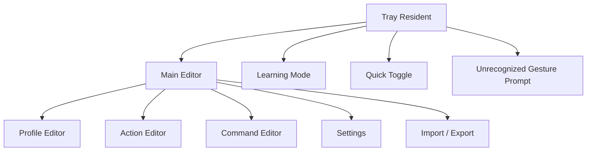

# ジェスチャー操作アプリ 要件ドラフト

作成日: 2026-06-23  
ベース調査対象: `StrokeIt Home .9.7`

## 1. 目的

Windows 常駐型のマウスジェスチャー操作アプリを新規実装する。  
既存の StrokeIt と同等の中核体験を持ちつつ、保存方式・UI・現代アプリ対応を改善する。

## 2. プロダクトゴール

- ユーザーが任意のジェスチャーで PC 操作を高速化できる
- アプリごとに異なるジェスチャー割り当てを持てる
- 学習・編集・バックアップが簡単
- レガシー実装に依存せず、将来拡張しやすい

## 3. 非ゴール

- StrokeIt の完全互換バイナリ
- StrokeIt の設定ファイル完全互換
- 初版からの外部DLLプラグイン対応
- 初版からの Lua スクリプト互換

## 4. 想定ユーザー

- PC 操作を高速化したいパワーユーザー
- ブラウザ、エディタ、ファイラーのショートカットを統一したいユーザー
- 画像編集や業務アプリで反復操作を短縮したいユーザー

## 5. MVP スコープ

### 必須機能

- Windows 常駐
- マウスジェスチャー認識
- グローバルプロファイル
- アプリ別プロファイル
- アプリ識別
  - 少なくとも `process name` と `window class`
- Action 管理
  - 1 Action に複数 gesture
  - 1 Action に複数 command
- Command 種別
  - Hotkey 送信
  - Program 実行
  - URL 起動
  - Window maximize/minimize/next/prev
- 学習モード
- 未認識ジェスチャーの学習導線
- トレイアイコン
- 一時無効化 / 有効無効切替
- Windows 起動時自動起動
- 設定のエクスポート/インポート

### あれば良い

- ジェスチャー描画色
- ジェスチャータイムアウト
- アプリ識別のワイルドカード
- 無効化専用プロファイル

## 6. 初版で外す機能

- 外部DLLプラグイン
- Lua scripting
- Business Trial / License 管理
- OSD の高度な装飾
- Win32 message send/post
- マルチモニタ専用操作
- Password 専用コマンド
- 古いアプリ向け大量プリセット同梱

## 7. 画面要件



### 画面一覧

- Tray resident state
- Main Editor
- Profile Editor
- Action Editor
- Command Editor
- Learning Mode
- Unrecognized Gesture Prompt
- Settings
  - General
  - Storage
  - Extensions
- Import / Export

## 8. 機能要件

### FR-01 ジェスチャー認識

- ユーザーはマウスボタン押下中の軌跡で gesture を入力できる
- システムは gesture を正規化して既存テンプレートと照合する
- システムは認識結果を最も適切な action に解決する

### FR-02 プロファイルマッチング

- プロファイルは以下の識別子を持てる
  - process name
  - window class
  - window title
- 1プロファイルに複数識別子を登録できる
- `exclude` 相当の無効化モードを持てる

### FR-03 アクション定義

- Action は名前を持つ
- Action は複数 gesture を持てる
- Action は複数 command を順序付きで持てる

### FR-04 コマンド実行

- 初版は以下の command を提供する
  - SendHotkey
  - SendText
  - RunProgram
  - OpenUrl
  - OpenMail
  - WindowMaxRestore
  - WindowMinimize
  - WindowNext
  - WindowPrev
  - Delay
  - DisableNextGesture

### FR-05 学習モード

- ユーザーは gesture サンプルを追加学習できる
- 既存 gesture へのサンプル追加と新規 gesture 作成を選択できる
- 認識結果レビューを表示する

### FR-06 未認識ジェスチャー導線

- 未認識時に通知できる
- そこから学習モードへ遷移できる
- 今後プロンプトを常に出す設定を持つ

### FR-07 設定

General:

- start with Windows
- tray icon visibility
- gesture button selection
- ignore modifier
- timeout
- draw gesture line on/off
- line color and width

Storage:

- config export path
- backup / restore
- language selection

Extensions:

- 将来の command provider を有効化/無効化できる設計

### FR-08 Import / Export

- プロファイル、gesture definitions、settings を1つのパッケージとして export できる
- 同パッケージを import できる
- 部分 import は将来拡張で可

## 9. データモデル案

```ts
type AppProfile = {
  id: string
  name: string
  enabled: boolean
  mode: "include" | "exclude"
  matchers: Matcher[]
  actions: GestureAction[]
}

type Matcher = {
  type: "process" | "class" | "title"
  value: string
  pattern: boolean
}

type GestureAction = {
  id: string
  name: string
  gestureIds: string[]
  commands: Command[]
}

type Command =
  | { type: "sendHotkey"; hotkey: string }
  | { type: "sendText"; text: string }
  | { type: "runProgram"; path: string; args?: string[]; cwd?: string }
  | { type: "openUrl"; url: string }
  | { type: "windowMaxRestore" }
  | { type: "windowMinimize" }
  | { type: "windowNext" }
  | { type: "windowPrev" }
  | { type: "delay"; ms: number }
  | { type: "disableNextGesture" }
```

## 10. 保存方式の提案

StrokeIt は `cfg + bin + registry` に分散しているが、独自アプリでは以下を推奨。

### 推奨

- `config.json` または `config.sqlite`
- `gesture_templates.json`
- `profiles.json`
- `export bundle (.zip or custom .json package)`

### 理由

- バックアップが簡単
- 差分比較しやすい
- 同期しやすい
- 将来の schema migration を制御しやすい

## 11. 技術要件

### 非機能

- 常駐時のメモリ消費は小さいこと
- ジェスチャー認識の遅延は体感 50ms 未満を目標
- 誤認識率を低く保つこと
- 管理者権限なしでも通常利用可能なこと

### 品質

- 認識精度の自動テスト
- プロファイルマッチングの単体テスト
- コマンド実行器の統合テスト
- Import/Export の往復テスト

## 12. 推奨アーキテクチャ

- `Input Hook Layer`
  - マウス入力取得
- `Recognition Layer`
  - 軌跡正規化
  - テンプレート照合
- `Profile Resolver`
  - 前景ウィンドウと profile の突合
- `Command Engine`
  - command の逐次実行
- `Settings/UI Layer`
  - 編集 UI
- `Persistence Layer`
  - JSON or SQLite

## 13. プリセット方針

初版の同梱プリセットは絞る。

### 推奨同梱

- Global
- Browser
- File Explorer
- Desktop
- Optional: Editor

### 同梱しない

- Winamp
- mIRC
- Outlook Express
- Internet Explorer
- Safari for Windows

## 14. 実装優先順位

### Phase 1

- 常駐
- gesture recognition
- global/app profile
- hotkey/run/url/window command
- settings UI

### Phase 2

- learning mode
- unrecognized prompt
- import/export
- wildcard matching

### Phase 3

- translation
- advanced commands
- extension model

## 15. リスク

- 入力フックの安定性
- 高DPI/複数モニタ環境での座標処理
- 前景ウィンドウ識別の揺れ
- 誤認識時の UX 悪化
- セキュリティ製品との相性

## 16. 結論

独自アプリの MVP は「軽量常駐」「アプリ別ジェスチャー」「編集しやすいUI」「基本コマンド群」に集中するのがよい。  
StrokeIt の価値は豊富なレガシー機能ではなく、少ない操作で強い自動化を組めることにある。そこを残して、保存方式と UX を現代化するのが最適解。
