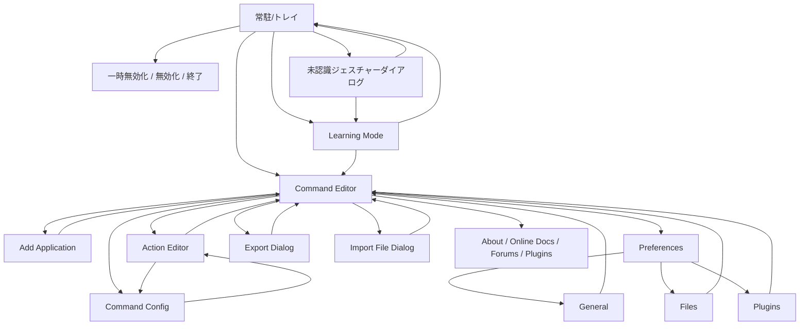

# StrokeIt 分析メモ

作成日: 2026-06-23  
対象: `StrokeIt Home .9.7`  
目的: リバースエンジニアリングではなく、同等機能を持つ独自アプリ開発のための要件把握

## 調査方針

- 実機にインストール済みの `StrokeIt Home .9.7` を観察
- 設定ファイル、文字列ファイル、プラグインDLL、レジストリ、起動設定を確認
- 公開サイトの静的ページも補助的に参照
- バイナリ解析や逆アセンブルはしていない

## 主要な証拠

### ローカル実体

- 実行ファイル: `C:\Users\ohkat\AppData\Local\TCB Networks\StrokeIt\Bin\strokeit.exe`
- 既定設定: `C:\Users\ohkat\AppData\Local\TCB Networks\StrokeIt\Bin\Default\Actions\*.cfg`
- 既定ジェスチャー定義: `C:\Users\ohkat\AppData\Local\TCB Networks\StrokeIt\Bin\Default\Gestures\STROKES.BIN`
- ユーザー設定: `C:\Users\ohkat\AppData\Roaming\TCB Networks\StrokeIt\Actions\*.cfg`
- ユーザージェスチャー定義: `C:\Users\ohkat\AppData\Roaming\TCB Networks\StrokeIt\Gestures\STROKES.BIN`
- 文字列定義: `C:\Users\ohkat\AppData\Local\TCB Networks\StrokeIt\Bin\Strings\**\English.lng`
- プラグイン: `C:\Users\ohkat\AppData\Local\TCB Networks\StrokeIt\Bin\Plugins\*.dll`
- ウィンドウ位置など: `HKCU\Software\TCB Networks\StrokeIt`
- 自動起動: `HKCU\Software\Microsoft\Windows\CurrentVersion\Run\StrokeIt`

### 公開ページ

- 公式トップ: <https://www.tcbmi.com/strokeit/>
- ダウンロード: <https://www.tcbmi.com/strokeit/downloads.shtml>
- スクリーンショット: <https://www.tcbmi.com/strokeit/shots.html>
- プラグイン一覧: <https://www.tcbmi.com/strokeit/plugins.html>
- Wikiトップ: <https://www.tcbmi.com/strokeit/wiki/>

---

## 1. ユーザーが利用できる全機能

### 1-1. 基本機能

- マウスジェスチャー認識
  - 公式ページ上は「80超のユニークなジェスチャー」を認識
  - 右ボタン押下で描画するのが既定動作
  - 設定上は左・中・右ボタンのいずれかをジェスチャー開始ボタンにできる
- ジェスチャー実行中のキャンセル
  - 左クリックでキャンセル
- 一時無効化
  - `Ctrl` 押下で一時的に無効化
  - 次の1ジェスチャーだけ無効化するコマンドもある
- 常駐動作
  - システムトレイ常駐
  - Windows起動時の自動起動に対応

### 1-2. 設定・編集機能

- Command Editor での設定編集
- アプリケーション単位のプロファイル作成
  - 識別子は `Window Class` / `Window Title` / `File Name`
  - ワイルドカードによるパターン一致対応
- アクション単位の設定
  - 1アクションに複数ジェスチャーを紐付け可能
  - 1アクションに複数コマンドを順次登録可能
- グローバルアクション
  - `[Global Actions]` 相当の既定領域あり
- 特定アプリでの無効化
  - `exclude=true` を持つ無効化プロファイルあり

### 1-3. 学習・認識補助

- 未認識ジェスチャー時のプロンプト
- Learning Mode
  - 新規ジェスチャー学習
  - 既存ジェスチャーの再学習
  - Recognized As の確認
  - Review
  - Save As
  - New Gesture
  - Remove Gesture

### 1-4. ファイル関連

- 設定の Import
- 設定の Export
- 文字列ファイル、アクションファイル、ジェスチャーファイル、プラグインファイルの保存先を変更可能
- 翻訳パックの導入
- プラグインDLLのロード/アンロード

### 1-5. 組み込みコマンド種別

ローカルの `Strings\**\English.lng` と `Plugins\*.dll` から確認できたコマンド種別は以下。

#### `siControl`

- Show Command Editor
- Show Learn Gestures
- Disable StrokeIt
- Shutdown StrokeIt
- Temporarily Disable

#### `win`

- Maximize or Restore
- Minimize
- Move
- Resize
- Next Window
- Previous Window
- Activate Window
- Wait for Window

#### `exec`

- Run Program
- Open Website
- Run Web Browser
- Run E-Mail Client
- New E-Mail message

#### `keys`

- Send Keystrokes
- Hotkey
- Password

#### `msg`

- Send Message
- Post Message

#### `multimon`

- Next Monitor
- Previous Monitor
- Primary Monitor
- Maximize to All

#### `OSD`

- On Screen Display

#### `utilities`

- MessageBox
- Ok/Cancel MessageBox
- Play Sound
- Toggle Always On Top
- Delay
- Standby Monitor(s)

### 1-6. 既定プロファイル

ユーザー設定ディレクトリ内に、以下の既定アプリケーションプロファイルが存在。

- Chat Programs
- Default
- Disabled Apps
- Explorer
- Google Chrome
- Internet Explorer
- Media Player
- mIRC
- Mozilla Firefox
- Opera
- Outlook Express
- Photoshop
- Safari
- Winamp
- Windows Desktop

### 1-7. 既定アクション例

- Default
  - Copy / Paste / Undo / Redo / Save / Open / New / Print / Find
  - Close Window / Close MDI Window / Quit
  - Run Explorer / Run Web Browser / Run E-Mail
  - Maximize/Restore / Minimize / Minimize All / Restore All
  - Task Next / Task Prev
- ブラウザ
  - Back / Forward / New Tab / Close Tab
- Photoshop
  - Pencil / Crop / Eraser / Eye Dropper / Gradient / Lasso / Magic Wand など
- Windows Desktop
  - Find / Minimize All / Restore All / 無効ジェスチャー

### 1-8. 入力の多様性

設定ファイル上、通常の描画ジェスチャー以外に以下も使われている。

- `MBUTTON_DOWN`
- `WHEEL_UP`
- `WHEEL_DOWN`

つまり本製品の概念上は、ドラッグ軌跡だけではなく「ボタン押下」や「ホイール操作」もトリガーとして扱える。

### 1-9. エディション差分

公式トップでは `.9.7` の Pro 版に以下が記載されている。

- Lua scripting
- 4/5 button mouse support

ただし今回ローカルで確認できたのは `Home .9.7` であり、Lua 機能は実機では未確認。

---

## 2. 画面遷移図

実機文字列定義と公式スクリーンショットから推定した画面遷移。



### 画面一覧

- 常駐/トレイ状態
- Command Editor
- Add Application
- Actions ダイアログ
- Command 設定ダイアログ
- Unrecognized Gesture ダイアログ
- Learning Mode
- Preferences
  - General
  - Files
  - Plugins
- Export Dialog
- Import File Dialog
- About

---

## 3. 設定項目一覧

`Strings\English.lng` から確認できた設定項目。

### General

- Always prompt to learn unrecognized commands
- Show StrokeIt icon in the system tray
- Only enable StrokeIt in configured applications
- Run StrokeIt when Windows starts
- Draw gestures by holding
  - Left Button
  - Middle Button
  - Right Button
- Ignore gestures by holding
- Gesture timeout after `N` milliseconds
- Draw colored line when entering gestures
  - Red
  - Green
  - Blue
  - Width

### Files

- Strings path
- Gestures path
- Actions path
- Plugins path
- Plugin Strings path
- Default interface language
- Browse

### Plugins

- Load/Unload

### Application 定義

- Window Class
- Window Title
- File Name
- Match text as pattern
- Disable gestures in this application

### Action 定義

- Gesture list
- Add Gesture
- Remove Gesture
- Command追加
- Command編集
- Command削除

### Command 設定

コマンド種別ごとに固有設定あり。例:

- Hotkey文字列
- Password文字列
- 実行ファイルパス
- 引数
- 開始フォルダ
- 実行方法
  - Maximized
  - Minimized
  - Normal Window
- Website URL
- Mail address
- Window class/title
- Match text as pattern
- Wait time
- Delay ms
- MessageBox caption/text
- OSD text, time, size, font, color, position
- Move/Resize の X/Y/Width/Height

---

## 4. データ保存方法

### 4-1. 保存構造

StrokeIt は DB 中心ではなく、以下のような「ファイル + レジストリ」の構成。

#### インストール配下

- 実行ファイル、DLL、翻訳、既定設定テンプレートを保持
- パス:
  - `C:\Users\ohkat\AppData\Local\TCB Networks\StrokeIt\Bin`

#### ユーザー設定配下

- アクション設定
  - `C:\Users\ohkat\AppData\Roaming\TCB Networks\StrokeIt\Actions\*.cfg`
- ジェスチャー認識データ
  - `C:\Users\ohkat\AppData\Roaming\TCB Networks\StrokeIt\Gestures\STROKES.BIN`

#### レジストリ

- `HKCU\Software\TCB Networks\StrokeIt`
  - InstallDir
  - VersionMajor / VersionMinor
  - Height / XPos / YPos
- `HKCU\Software\Microsoft\Windows\CurrentVersion\Run\StrokeIt`
  - 自動起動設定

### 4-2. ファイル形式

#### `*.cfg`

- プレーンテキスト
- 1ファイル = 1アプリケーションプロファイル
- アプリ識別子、除外フラグ、アクション、ジェスチャー、コマンド定義を保持

例:

```txt
class=Chrome_WidgetWin_0
Back [Left] {
   gesture = Left
   Alt+Left = keys, hotkey [ALT_DOWN][LEFT][ALT_UP]
}
```

#### `STROKES.BIN`

- バイナリ
- ジェスチャー認識テンプレート/学習結果を保持していると考えられる
- 既定値とユーザー値で別ファイル

### 4-3. 設計観点での示唆

- 可搬性はあるが、データの分散が大きい
- アクション設定は可読だが、認識テンプレートは不可読
- 現代実装では JSON/SQLite などへの統合余地が大きい

---

## 5. ファイル入出力

### 入力

- `Actions\*.cfg` 読み込み
- `Gestures\STROKES.BIN` 読み込み
- `Plugins\*.dll` 読み込み
- `Strings\*.lng` 読み込み
- 翻訳パック導入
- プラグイン追加導入

### 出力

- `Actions\*.cfg` 更新
- `Gestures\STROKES.BIN` 更新
- Import/Export による設定パッケージ入出力
  - 画面文字列上で存在確認済み
  - ただしエクスポート拡張子そのものは今回未確認

### 外部連携としての入出力

- 実行ファイル起動
- URL起動
- メールクライアント起動
- 新規メール作成
- キーボード送信
- Win32メッセージ送信/ポスト
- サウンド再生

---

## 6. 想定ワークフロー

### ワークフロー A: そのまま使う

1. インストール
2. 自動起動で常駐
3. 既定の Global Actions を利用
4. ブラウザやエクスプローラで既定ジェスチャーを使う

### ワークフロー B: アプリ別に最適化する

1. Command Editor を開く
2. Application を追加
3. Window Class / Title / File Name で対象を定義
4. Action を追加
5. Gesture を割り当てる
6. Command を複数登録
7. 保存して実アプリで試す

### ワークフロー C: 未認識ジェスチャーを学習させる

1. 未認識ジェスチャーを実行
2. プロンプトを表示
3. Learn を選択
4. 既存ジェスチャーに学習追加、または新規ジェスチャーとして保存

### ワークフロー D: 競合回避

1. ゲームなど対象アプリを `Disabled Apps` へ定義
2. `exclude=true` として無効化
3. 該当アプリ上ではジェスチャー認識を止める

### ワークフロー E: 設定持ち運び

1. Export Config
2. 他端末またはバックアップ先へ保存
3. Import Config で復元

---

## 7. MVP版で必要な機能

独自アプリとして「StrokeIt と同等体験の核」を作るなら、以下が MVP の最小構成。

### P0

- バックグラウンド常駐
- マウスジェスチャー認識
- グローバルプロファイル
- アプリ別プロファイル
- 1アクションに対する複数ジェスチャー
- 1アクション内の複数コマンド逐次実行
- 基本コマンド
  - Send Hotkey
  - Run Program / Open URL
  - Window Max/Min/Next/Prev
- 設定UI
  - Application 一覧
  - Action 一覧
  - Command 編集
- 学習モード
- システムトレイ常駐と有効/無効切替
- 自動起動

### P1

- 未認識ジェスチャープロンプト
- 設定 Import/Export
- ジェスチャー描画色やタイムアウトの設定
- パターン一致によるウィンドウ識別
- 無効化プロファイル

### P2

- 翻訳機構
- プラグイン読み込み
- OSD
- Win32 Message
- マルチモニタ専用コマンド

---

## 8. 不要と思われる機能

独自アプリの初期版では、以下は後回しでよい可能性が高い。

### 優先度低

- レガシー向け既定プロファイル
  - Outlook Express
  - mIRC
  - Winamp
  - Internet Explorer
  - Safari for Windows
- 翻訳パック配布導線
- Message/Post Message のような Win32 直叩き機能
- OSD の細かなフォント/色指定
- Standby Monitor(s)
- Maximize to All / monitor move などの専用マルチモニタ機能
- Password 専用コマンド

### MVPでは不要

- 外部DLLプラグインアーキテクチャ
- ライセンス/Business Trial 分岐
- Pro専用の Lua scripting
- 4/5 button mouse の専用対応

---

## 実装上の示唆

- StrokeIt は「認識エンジン + プロファイルマッチング + コマンド実行器」の3層で整理できる
- 現代実装では以下の置き換えが望ましい
  - `cfg/bin/registry` 分散保存 -> 単一 JSON/SQLite
  - 外部DLLプラグイン -> 内部コマンドレジストリ
  - レガシーアプリ向けプリセット多数同梱 -> 少数の現代アプリテンプレート
- 体験の核は「素早く登録できる UI」と「誤爆しない認識・対象判定」

## まとめ

StrokeIt Home .9.7 の本質は、Windows 常駐型のジェスチャー認識と、アプリ別プロファイルに基づくコマンド実行を、非常に軽量な設定ファイルベースで提供する点にある。独自アプリでは、ここを保ちつつ、保存方式・UI・現代アプリ対応・拡張方法を刷新するのが最も筋がよい。
